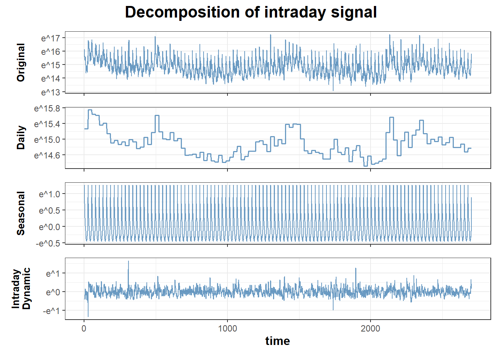
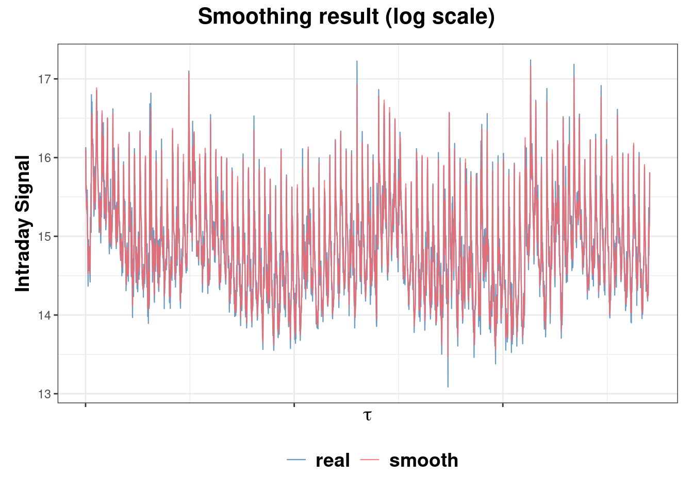
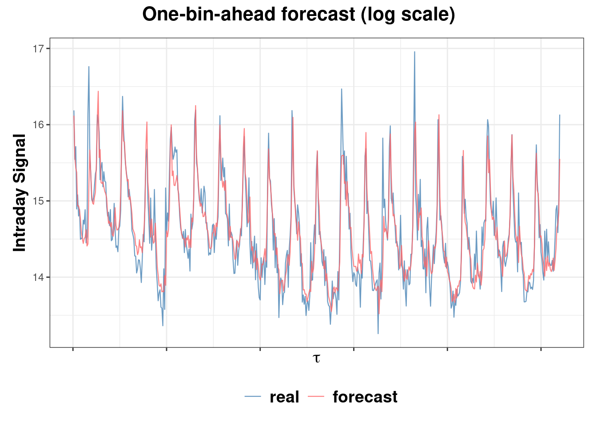

<!-- README.md is generated from README.Rmd. Please edit that file -->

# intradayModel

Our package uses state-of-the-art state-space models to facilitate the
modeling and forecasting of financial intraday signals. This package
currently offers a univariate model for intraday trading volume, with
new features on intraday volatility and multivariate models in
development. It is a valuable tool for anyone interested in exploring
intraday, algorithmic, and high-frequency trading.

## Installation

The package can be installed from
[GitHub](https://github.com/convexfi/intradayModel):

``` r
# install development version from GitHub
devtools::install_github("convexfi/intradayModel")
```

Please cite **intradayModel** in publications:

``` r
citation("intradayModel")
```

## Quick Start

To get started, we load our package and some sample data: the 15-minute
intraday trading volume of AAPL from 2019-01-02 to 2019-06-28, covering
124 trading days.

``` r
library(intradayModel)
data(aapl_volume)
aapl_volume[1:5, 1:5] # print the head of data
#>          2019-01-02 2019-01-03 2019-01-04 2019-01-07 2019-01-08
#> 09:30 AM   10142172    3434769   20852127   15463747   14719388
#> 09:45 AM    5691840   19751251   13374784    9962816    9515796
#> 10:00 AM    6240374   14743180   11478596    7453044    6145623
#> 10:15 AM    5273488   14841012   16024512    7270399    6031988
#> 10:30 AM    4587159   18041115    8686059    7130980    5479852
```

Next, we fit a univariate state-space model using `fit_volume`
function. To be specific, we use the first 104 trading days for fitting,
and the last 20 days for evaluation of forecasting performance.

``` r
aapl_volume_training <- aapl_volume[, 1:104]
model_fit <- fit_volume(aapl_volume_training)
```

Once the model is fitted, we can estimate the hidden components of any
intraday signal based on all its observations, which is called
**smoothing**. By calling `smooth_volume_model` function, we obtain daily,
seasonal, and intraday dynamic components. This procedure helps us
better identify the underlying information of the intraday signal.

``` r
smooth_result <- smooth_volume_model(aapl_volume_training, model_fit)
plot_components(smooth_result) # plot smoothed hidden components
```



``` r
plot_performance(smooth_result) # plot smoothed result
```



To see how well our model performs on new data, we use
`forecast_volume_model` function to do one-bin-ahead forecast on the
out-of-sample dataset of 20 days.

``` r
forecast_result <- forecast_volume_model(aapl_volume, model_fit, out_sample = 20)
plot_components(forecast_result) # plot forecast hidden components
```


``` r
plot_performance(forecast_result) # plot forecast result
```



## Contributing

We welcome all sorts of contributions. Please feel free to open an issue
to report a bug or discuss a feature request.

## Citation

If you make use of this software please consider citing:

-   Chen, R., Feng, Y., and Palomar, D. (2016). Forecasting intraday
    trading volume: A kalman filter approach.
    <https://dx.doi.org/10.2139/ssrn.3101695>

## Links

Package: [GitHub](https://github.com/convexfi/intradayModel)

README file:
[GitHub-readme](https://github.com/convexfi/intradayModel/blob/master/README.md).

Vignette:
[GitHub-vignette](https://htmlpreview.github.io/?https://github.com/convexfi/intradayModel/blob/master/vignettes/intradayModel.html).
