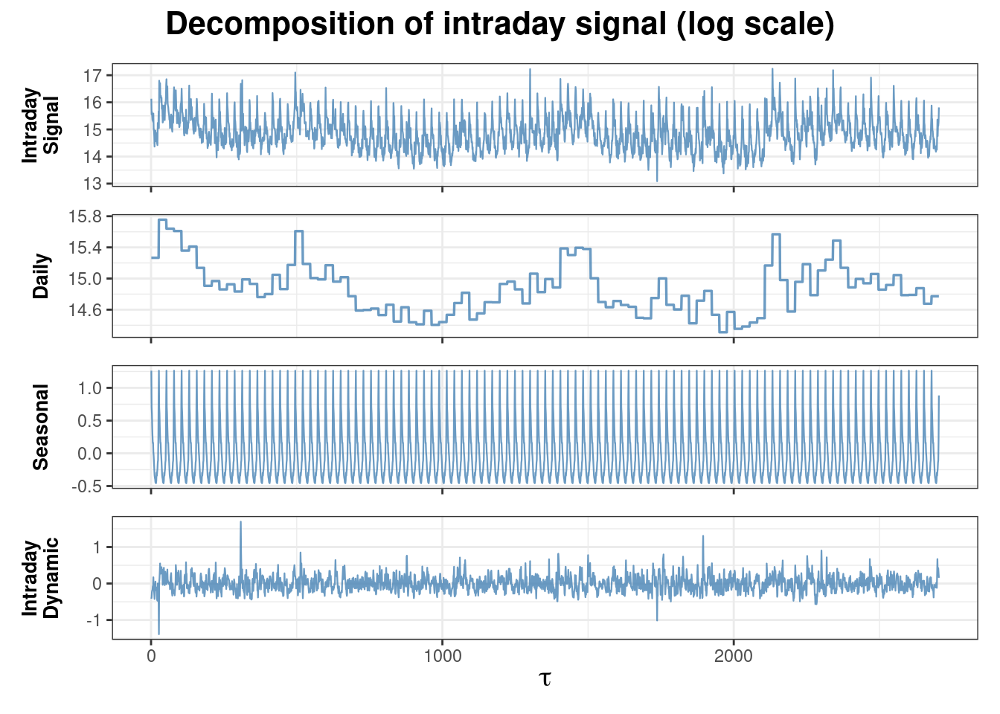
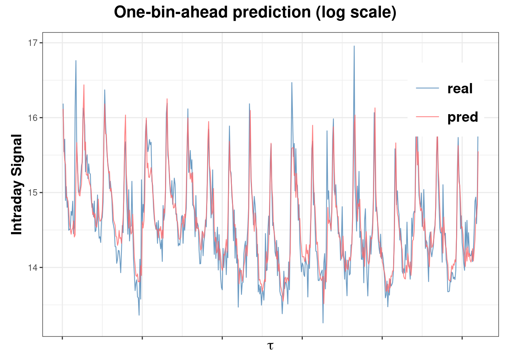

<!-- README.md is generated from README.Rmd. Please edit that file -->

Model and forecast financial intraday signals, including trading volume
and volatility, using state-space models. Currently, the univaraite
state-space model for intraday trading volume is available.

## Installation

The package can be installed from
[GitHub](https://github.com/convexfi/intradayModeling):

``` r
# install development version from GitHub
devtools::install_github("convexfi/intradayModeling")
```

## Quick Start

To get started, we load the package and some sample data: the 15-minute
intraday trading volume of AAPL from 2019-01-02 to 2019-06-28, covering
124 trading days.

``` r
devtools::load_all()
data(AAPL_volume)
AAPL_volume[1:5, 1:5]
#>          2019-01-02 2019-01-03
#> 09:30 AM   10142172    3434769
#> 09:45 AM    5691840   19751251
#> 10:00 AM    6240374   14743180
#> 10:15 AM    5273488   14841012
#> 10:30 AM    4587159   18041115
#>          2019-01-04 2019-01-07
#> 09:30 AM   20852127   15463747
#> 09:45 AM   13374784    9962816
#> 10:00 AM   11478596    7453044
#> 10:15 AM   16024512    7270399
#> 10:30 AM    8686059    7130980
#>          2019-01-08
#> 09:30 AM   14719388
#> 09:45 AM    9515796
#> 10:00 AM    6145623
#> 10:15 AM    6031988
#> 10:30 AM    5479852
```

Next, we define a univariate state-space model using the `uniModelSpec`
function.

``` r
model <- uniModelSpec(fit = TRUE)
```

Then, we use the first 104 trading days to fit the model and the last 20
days to evaluate its forecasting performance. Fitting can be achieved by
the `uniModelFit` function.

``` r
data <- AAPL_volume
data_train <- AAPL_volume[, 1:104]
model_fitted <- uniModelFit(data_train, model, acceleration = TRUE)
#> iter:5 diff:0.002868336
#> iter:10 diff:0.001158425
#> iter:15 diff:0.001227888
#> iter:20 diff:0.0007639653
#> iter:25 diff:0.0005356731
#> iter:30 diff:0.0002915528
#> iter:35 diff:0.0003324134
#> Success! abstol test passed at 37 iterations.
```

Once the model is fitted, we use the `uniModelFilter` function to
decompose intraday trading signal into daily, seasonal, and intraday
dynamic components. This helps us better understand the composition of
the intraday signal.

``` r
filter_result <- uniModelFilter(data_train, model_fitted)
filter_result$plot
```



To see how well our model performs on new data, we use the
`uniModelPred` function to do one-step-ahead prediction on the last 20
trading days of the dataset. This function also helps to evaluate the
accuracy of the forecast.

``` r
predict_result <- uniModelPred(data, model_fitted, out.sample = 20)
predict_result$measure
#>        mae      mape    rmse
#> 1 631351.4 0.2085738 1418007
predict_result$plot
```



## Links

Package: [GitHub](https://github.com/convexfi/intradayModeling)

README file:
[GitHub-readme](https://github.com/convexfi/intradayModeling/blob/master/README.md).

Vignette:
[GitHub-vignette](https://htmlpreview.github.io/?https://github.com/convexfi/intradayModeling/blob/master/vignettes/intradayModel.html).
